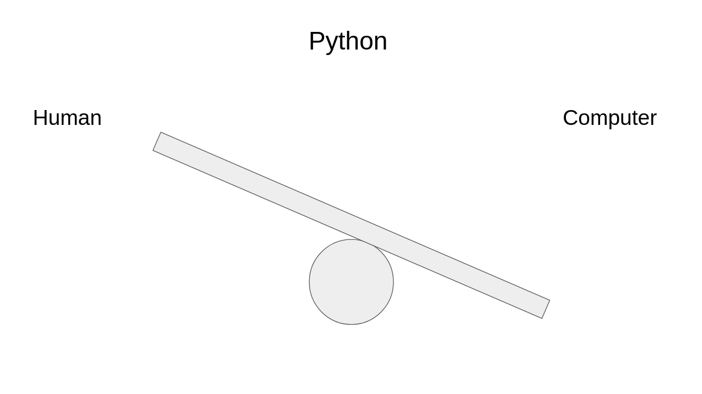

# High Level

Python is a programming language created by Guido \(pronounced gree-do\) Van Rossum. Specifically, Python is an _intrepreted_, _high-level_, _general purpose_ programming language.

Let's talk about what these mean.

## High Level

Let's use a different language as an example, C++. When we write code in C++ code, we write it in a language similar to English.

```cpp
#include <iostream>
int main()
{
  std::cout << "Hello, World!" << std::endl;
  return 0;
}
```

This code prints "Hello, World!" to the screen. Looks confusing, right? But if you read the words you can see some English words. `main`, include, end, "Hello, World!", return and some more.

When we write code, we write it in a language that is similar to English but also technical enough for the computer to understand.

Normal English is a bad programming language, since we can mean different things from the same sentence. For example:

"Alright" and "Alright" mean 2 different things in British English \(Alright means "hello" and "it's good"\).

The computer would have no idea how to interpret this. English is a bad programming language, so we have to use something that's a mixture of something the computer can understand and something we can understand.

In the case of C++ that mixture is more 50% human, 50% computer \(arbitrary numbers\). The more the mixture leans to the human side, the more "high level" it is


Python is more high level, so it leans more to the human side.



Take a look at this Python code:

```python
def hello_world():
	print("Hello, World!")
```

If I told you that `def` was short for `define` you'd now know every single word in that program. Whereas with C++ it was a lot harder to understand.

This is what we mean by high level and low level.

**Python is high level because it is more understandable by humans with no programming experience.** Whereas C++ is less understandable.

Now, what if I told you that I lied to you? The computer doesn't understand any human language at all.

That's right! Even C++ it doesn't understand. What if I told you that there's an even more un-readable language called Assembly?

 Here's an example I stole from the [web](https://cs.lmu.edu/~ray/notes/x86assembly/), "Hello, World!" in x86 Assembly.

```text
global    _start

          section   .text
_start:   mov       rax, 1                  ; system call for write
          mov       rdi, 1                  ; file handle 1 is stdout
          mov       rsi, message            ; address of string to output
          mov       rdx, 13                 ; number of bytes
          syscall                           ; invoke operating system to do the write
          mov       rax, 60                 ; system call for exit
          xor       rdi, rdi                ; exit code 0
          syscall                           ; invoke operating system to exit

          section   .data
message:  db        "Hello, World", 10      ; note the newline at the end
```

This language right here is very machine-like, but the computer still cannot understand it!


So, what does the computer understand? In terms of our very weird see-saw:


Imagine someone takes our see-saw, they carry the plank to Mars and they stand it up. That's what it's like. The computer does not understand the human language **at all**.

If computers cannot understand the human language, why do we write human language? Why do we not write in machine language? How does the computer understand human language, the?

1.Why do we write human language, not machine language?

Abstraction. Abstraction is where we take something complex, we remove some of the complexity and make it simpler.

Abstraction is the backbone of every computer scientist in the world, and all machines. Abstraction is what causes exploits in machines, but it's also what causes better & more secure code to be written.

The "Hello, World!" function in x86 assembly you saw is 12 lines. In Python, we can make it one line:

```python
print("Hello, World!")
```

If we had to write 12 lines for every 1 line of Python, we'd never finish any software.

Not to mention that it's far easier for us to introduce bugs in code if there are more lines then less.

With Python, we know that other people smarter than us have read the `print` code and can confirm it cannot be exploited.

With our hand-written Assembly, we cannot.

In fact, we cannot even confirm that our assembly code is the most efficient method. In C++ we use something called zero cost abstractions for this. See my Rust room for more information `room code: rust`.

2. How does the computer understand human language?

Bingo! This is where I was going with this.

Let's say you're from the United Kingdom. And you visit China. Here's a typical conversation:

> You: "Oi bruv givs a botla ov wotr"
>
> Shop Keeper: 你这个傻小子，我们这里不说这种语言

Do you see the problem here?

Now, how would you go about talking to the shop keeper?

You'd use a translator. Either a person, or an app.

How does our human-readable code talk to the computer? We use a translator called a _compiler_.

The compiler converts our code into binary code for the computer to understand. And at the end, we get an executable file we can run.

Translating is rather slow and expensive. We don't want to spend 5 minutes translating!

This brings us onto....

