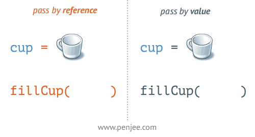

# Variables

Now in the last section, I said "String \(a string of characters\)".

What does that mean?

In programming we need to have data types. Every bit of data has a type in common with it. You already know some.

If I said:

```python
1, 2, 3, 4, 5, 6, 7, 8, 9
```

"Are these sentences?"

No! They're numbers.

See, you already know data types 😜

In Python, it's the same. We have some essential data types that hold things:

* String \(a string of characters\)
* Integer - a whole number \(-50, 50, 60, 91\)
* Float - a floating point number \(21.3, -5.1921\)
* List - a list of items \(\[1, 2, 3\], \["hi", 6, 7.91\]\)

And more.

Now, let's dis-spell a myth.

Variables are like buckets in the sense that you can store things in them. Imagine a bucket and you want to put a sentence into it:


We make a bucket called hello and in the bucket we put in the string \`Hello, World!"

```python
hello = "Hello, World!"
```

We use the equals sign as an _assignment operator_. It assigns the value on the right hand side to the bucket on the left.

Now let's say we wanted to add this variable to another variable. A common misconception is that we take the bucket itself and use that.

But in Python, we don't. We _pass by reference_. As in, we merely pass a location of the variable — we do not pass the variable itself. The alternative is _pass by value_.

This is very important to understand, as it can cause a significant amount of headaches later on.



Remember lists from earlier?

```python
hellos = ["Hello", "yo", "sup?", "alright?"]
```

Lists have different methods which allow us to manipulate the list. A popular one is appending an item to a list, like this:

```python
hellos = ["Hello", "yo", "sup?", "alright?"]
hellos.append("TryHackMe")
print(hellos)
# ["Hello", "yo", "sup?", "alright?", "TryHackMe"]
```

Let's see this bug in action.

```python
list1 = [1, 2]
list2 = [3, 4]
list1.append(list2)
# List1 is now [1, 2, [3, 4]]
# We appended the list, not the contents of the list
```

When we append a list to another list, we do not merge the elements together. Instead we append the entire list \(including the list itself\) to the other list.

```python
# Continueing from last code block
list2.append(6)
print(list1)
# [1, 2, [3, 4, 6]]
```

Now, let's look at the bug in more detail:

```python
list1 = [1, 2]
list2 = [3, 4]
list1.append(list2)
list2.append(6)
print(list1)
# [1, 2, [3, 4, 6]]
```

When we appended `list2` to `list1`, we did not actually append the list. We appended the reference to the list.

When we changed `list2`, because `list1` had the reference appended it "updates" itself to match the newly updated `list2`.

In Python, this type of bug can happen all the time. We never pass the values of things, always the references. So be sure to keep an eye open for this type of thing.

In some languages like Rust you get the option of value or reference. But in Python, you only get the option of reference. This is because if we started passing values, Python would have to spend more time on their garbage collection system.

Garbage collection is where we store variables in the system and remove them when they are no longer needed. Higher level languages do this automatically. Lower level languages you might have to do it yourself.

There are a whole bunch of other data types in Python, but I'll explain most of them throuhout this room.

Here's a quick table for data structures in Python:

| String | A string of characters | `"Hello"` | `str(x)` |
| :--- | :--- | :--- | :--- |
| Boolean | True or False value | `True`, `False` | `bool(x)` |
| Integer | A whole number | `50` | `int(x)` |
| Float | A floating point number | `6.11` | `float(x)` |
| List | A list of items | `[1, 2, 3]` | `list(x)` |
| Dictionary | A key:value pairing. Talked about later. | `{1: "One"}` | `dict(x)` |

